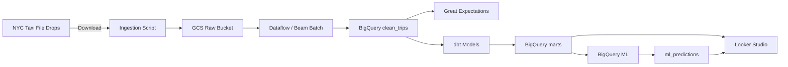

# Architecture

```mermaid
graph LR
  A[NYC Taxi File Drops] -->|Download| B[Ingestion Script]
  B --> C[GCS Raw Bucket]
  C --> D[Dataflow / Beam Batch]
  D --> E[BigQuery clean_trips]
  E --> F[Great Expectations]
  E --> G[dbt Models]
  G --> H[BigQuery marts]
  H --> I[BigQuery ML]
  I --> J[ml_predictions]
  H --> K[Looker Studio]
  J --> K
```

## Layers
- Raw: files stored in GCS.
- Clean: typed records in BigQuery.
- Marts: dbt aggregates for reporting.
- ML: BigQuery ML model + predictions.
